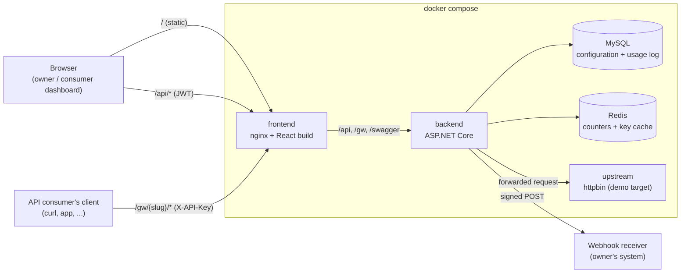
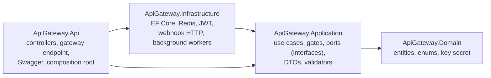

# Architecture

## Runtime view



One backend process serves two very different kinds of traffic:

- **Management API** (`/api/...`): JSON endpoints behind JWT, used by the dashboard. Documented in Swagger.
- **Gateway** (`/gw/{slug}/{**path}`): proxied traffic authenticated by API key.

The backend is also reachable directly on port 8080; nginx on port 3000 puts the dashboard and the
backend behind one origin.

## Code structure (backend)

Four projects, dependencies pointing inwards only:



| Project | Contains | Knows about |
|---|---|---|
| `Domain` | Entities with their invariants (`Tier`, `ApiKey.Revoke`, ...), enums, `ApiKeySecret` | nothing |
| `Application` | One service per feature, the gateway gates, the ports they need, DTOs, validators | Domain, EF Core's `DbSet` abstraction |
| `Infrastructure` | Implementations of the ports: `AppDbContext`, `RedisFixedWindowCounter`, `CachedKeyContextResolver`, `EfCreditLedger`, `JwtTokenIssuer`, `UsageWriterService`, `WebhookDispatcherService` | Application |
| `Api` | Thin controllers, `GatewayRequestHandler`, `YarpUpstreamForwarder`, error mapping, DI wiring | everything (it is the composition root) |

Features are folders inside each layer (`Apis`, `Tiers`, `Keys`, `Webhooks`, `Analytics`, `Billing`,
`Consumers`, `Gateway`), so a feature's request types, validator and service sit together.

## Code structure (frontend)

```
frontend/src
├── api/          schema.d.ts (generated from Swagger), types.ts (aliases), client.ts (fetch wrapper)
├── components/   shared primitives: Button, Field, FormDialog, DataTable, QueryView, Display, AppLayout
├── features/     auth, apis, tiers, keys, webhooks, analytics, consumers, billing
│                 each: queries.ts (data access hooks) + its pages/tabs
└── lib/          format.ts, gateway.ts, queries.ts
```

## Where SOLID shows up

| Principle | In this codebase |
|---|---|
| **Single responsibility** | Each gate checks one thing. `GatewayRequestHandler` translates HTTP, `GatePipeline` decides, `YarpUpstreamForwarder` proxies, `RequestSettlement` charges and meters. `WebhookSender` does one POST; retrying belongs to `WebhookDispatcherService`. |
| **Open/closed** | A new admission check is a new `IRequestGate` class plus one registration line in `Application/DependencyInjection.cs`; nothing existing changes. A new webhook event is a new entry in `WebhookEventNames` and a rule in `QuotaAlertPolicy`. |
| **Liskov substitution** | `CachedKeyContextResolver` decorates `EfKeyContextResolver` behind the same `IKeyContextResolver`; the unit tests swap Redis for `InMemoryFixedWindowCounter` with the same contract. |
| **Interface segregation** | Ports are small and separate: resolving a key (`IKeyContextResolver`) and evicting it (`IKeyContextInvalidator`) are different interfaces even though one class backs both; `IUsageSink` has a single method. |
| **Dependency inversion** | Application code depends only on ports declared in `Application/Abstractions`. Redis, MySQL, JWT, HTTP and the clock (`TimeProvider`) are all injected. |

## Where DRY shows up

| One definition of... | Lives in |
|---|---|
| The fixed-window algorithm (used for both the per-minute limit and the monthly quota) | `FixedWindow` + `IFixedWindowCounter` |
| Every Redis key format | `Application/Common/StoreKeys.cs` |
| "Does this request consume quota?" (used to seed counters and to show consumers their usage) | `UsageRules.ConsumesQuota` |
| Turning usage rows into totals (overall, per bucket, per consumer; owner and consumer views) | `OutcomeTally` + `UsageAggregator` |
| "An owner may only touch their own APIs" | `OwnedApiGuard` |
| Mapping a failed `Result` to an HTTP response, and the error document shape | `ApiControllerBase` + `ErrorResponses` (also used by the gateway and the exception handler) |
| Running validators | `ValidationFilter` (no controller calls a validator) |
| Documenting error responses in Swagger | `ProblemResponsesOperationFilter` |
| DTO shapes shared by backend and frontend | generated `frontend/src/api/schema.d.ts` |
| Loading/error/data rendering for a query | `QueryView` |
| Create/edit forms (validation, pending state, server error) | `FormDialog` |
| Usage summary tiles + chart for owner and consumer | `UsageReport` |
| Design tokens (light and dark) | `frontend/src/index.css` |

## Background work

Two hosted services keep slow work off the request path:

- `UsageWriterService` drains an in-memory channel and batch-inserts `UsageRecords` ([0012](decisions/0012-asynchronous-usage-metering.md)).
- `WebhookDispatcherService` drains quota alerts, sends webhooks with retries and logs each delivery ([0014](decisions/0014-webhook-delivery.md)).
