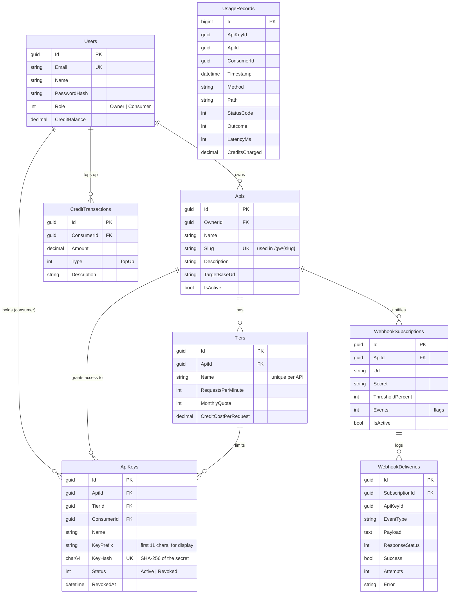

# Data model

## MySQL

Every table except `UsageRecords` also has `CreatedAt`. All timestamps are UTC.

### Notes

- **The entity for the `Apis` table is called `RegisteredApi`** in code, because a class named `Api`
  would collide with the `ApiGateway.Api` namespace.
- **IDs are version-7 GUIDs** (time-ordered), generated in the application, so inserts are index-friendly
  and an entity knows its id before it is saved. `UsageRecords` uses an auto-increment `bigint` because
  it is a high-volume, append-only log.
- **`UsageRecords` has no foreign keys on purpose.** It must be cheap to insert into and must outlive
  the keys and APIs it refers to (deleting an API keeps its history). It is indexed by
  `(ApiId, Timestamp)`, `(ConsumerId, Timestamp)` and `(ApiKeyId, Timestamp)`, which are exactly the
  three ways it is queried.
- **`Outcome`** is one of `Success`, `Failed`, `RateLimited`, `QuotaExceeded`, `InsufficientCredits`
  (see [gateway-request-flow.md](gateway-request-flow.md)).
- **Credit usage is not duplicated** into `CreditTransactions`: what a consumer spent is the sum of
  `UsageRecords.CreditsCharged`. `CreditTransactions` holds only top-ups.
- **Deleting an API cascades** to its tiers, keys, webhooks and their delivery log. The key-to-tier
  foreign key also cascades, purely so that deleting an API (which removes its tiers) is not blocked
  by that API's own keys; deleting a tier that still has keys is refused by the application
  (`TierService`), so that cascade never fires on its own.
- Money-like values are `decimal(18,4)`.

## Redis

Every key format is defined in one place: `backend/src/ApiGateway.Application/Common/StoreKeys.cs`.

| Key | Type | Value | Expires | Purpose |
|---|---|---|---|---|
| `rl:{keyId}:{yyyyMMddHHmm}` | string (counter) | requests seen this minute | end of the minute + 5 s | Rate limit |
| `quota:{keyId}:{yyyyMM}` | string (counter) | forwarded requests this month | end of the month + 1 h | Monthly quota |
| `keyctx:{sha256(key)}` | string (JSON) | key + API + tier snapshot, or `-` for "no such key" | 60 s (15 s for `-`) | Skip MySQL when authenticating |
| `alert:{keyId}:{yyyyMM}:{event}:{percent}` | string | `1` | 40 days | Send each quota alert once |

Redis holds nothing that cannot be rebuilt: rate-limit counters are short-lived, quota counters are
re-seeded from `UsageRecords`, and the key cache is refilled from MySQL. The one exception is the alert
marker: if it is lost mid-month, a quota alert could be sent a second time.
