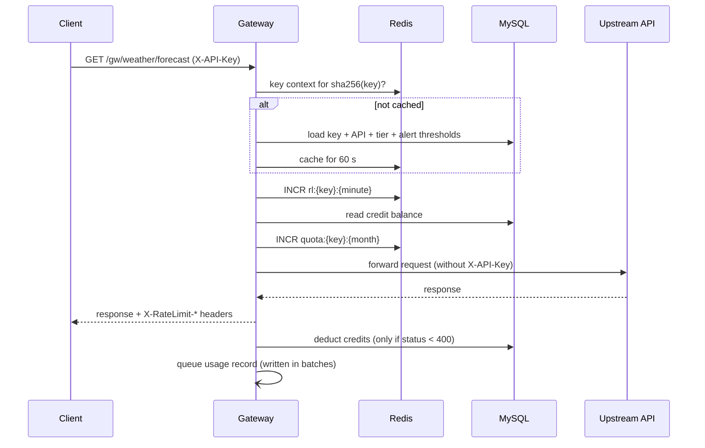

# Gateway request flow

```
ANY /gw/{apiSlug}/{path...}?{query}
X-API-Key: gw_...
```

Everything after `/gw/{apiSlug}` (path and query string) is appended to the API's target base URL.
Example: with target `https://api.example.com/v1`, `GET /gw/weather/forecast?city=Pune` becomes
`GET https://api.example.com/v1/forecast?city=Pune`.

## Sequence



## The gates

Checks run in this order; the first one that refuses ends the request
(see [0008](decisions/0008-gate-pipeline.md) for why this order).

| # | Gate | Refuses when | Status | `code` | Metered as |
|---|---|---|---|---|---|
| 1 | `ApiKeyGate` | header missing | 401 | `missing_api_key` | not metered |
| | | key unknown | 401 | `invalid_api_key` | not metered |
| | | key revoked | 401 | `revoked_api_key` | not metered |
| | | key belongs to a different API than `{apiSlug}` | 403 | `key_not_valid_for_api` | not metered |
| | | API disabled by its owner | 503 | `api_inactive` | not metered |
| 2 | `RateLimitGate` | more than *requests per minute* in the current clock minute | 429 | `rate_limit_exceeded` | `RateLimited` |
| 3 | `CreditGate` | balance is lower than the tier's cost per request | 402 | `insufficient_credits` | `InsufficientCredits` |
| 4 | `QuotaGate` | more than *monthly quota* forwarded requests in the current calendar month (UTC) | 429 | `quota_exceeded` | `QuotaExceeded` |

After the gates the request is forwarded:

| Upstream result | Status returned | Metered as | Charged |
|---|---|---|---|
| Any status below 400 | passed through | `Success` | tier's credit cost |
| 4xx / 5xx | passed through | `Failed` | nothing |
| Connection failed or dropped | 502 | `Failed` | nothing |
| No response in time | 504 | `Failed` | nothing |

"Not metered" requests cannot be attributed to a consumer (or never reached a limit), so they do not
appear in usage analytics.

## Response headers

Sent on every response that got past authentication, allowed or not:

| Header | Meaning |
|---|---|
| `X-RateLimit-Limit` | The tier's requests per minute |
| `X-RateLimit-Remaining` | Requests left in the current minute |
| `X-RateLimit-Reset` | Unix time (seconds) at which the current minute window ends |
| `Retry-After` | Only on 429: seconds until the limit that was hit resets (end of the minute, or end of the month for quota) |

## Error body

Gateway errors use the same shape as the management API: RFC 7807 problem details with a stable `code`.

```json
{
  "title": "Too Many Requests",
  "status": 429,
  "detail": "Rate limit of 5 requests per minute exceeded.",
  "code": "rate_limit_exceeded"
}
```

Responses produced by the upstream API are passed through untouched.

## What is and is not forwarded

- Method, path, query string, body and headers are forwarded (hop-by-hop headers are handled by YARP).
- `X-API-Key` is removed: the gateway credential never reaches the upstream.
- `Host` is set to the upstream's host.
- Redirects from the upstream are returned to the client, not followed.

## Worth knowing

- **Order of limits.** A request rejected for quota or credits has already consumed one slot of the
  per-minute rate limit. It does not consume quota or credits.
- **Window alignment.** Windows are aligned to the clock (minute `:00`, first of the month, UTC), not to
  the first request. A client can therefore send up to twice the per-minute limit across a window
  boundary; that is the known trade-off of a fixed window ([0009](decisions/0009-fixed-window-rate-limiting.md)).
- **Edits apply immediately.** Changing a tier, disabling an API or revoking a key takes effect on the
  next request ([0015](decisions/0015-key-context-caching.md)).
- **Redis is required.** If Redis is unavailable the gateway answers `500` (after a timeout of about
  five seconds) rather than letting unmetered traffic through. The dashboard's read endpoints keep working.
